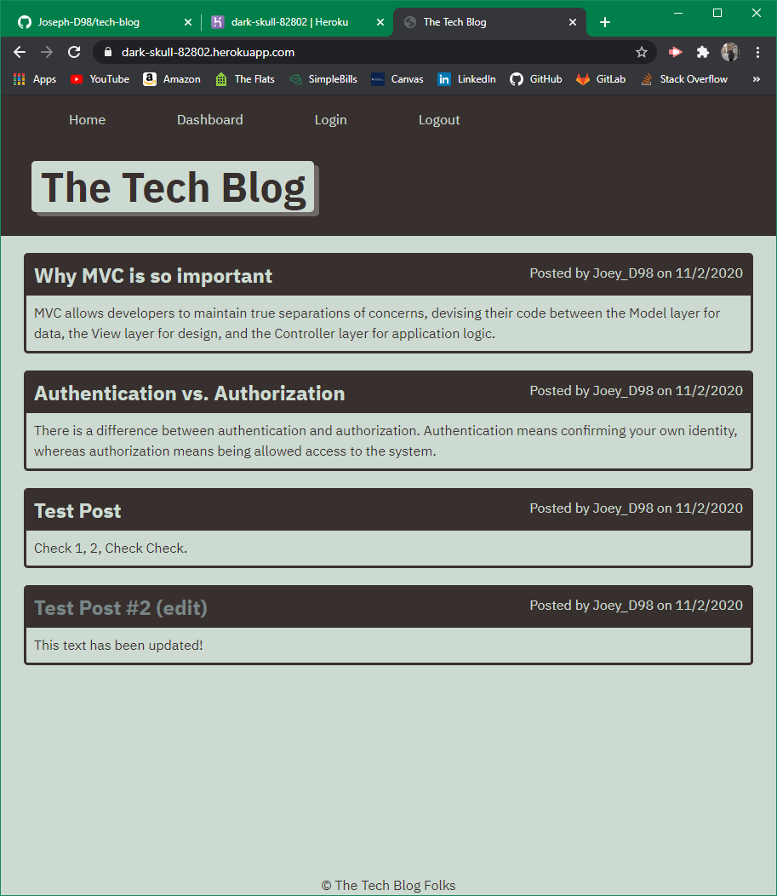

# Tech-Blog

## Description
A website designed to publish articles, blog posts, thoughts and opinions about tech. The construction of the application showcases Model View Controller(MVC) programming.

## Usage
Deployed Application URL: https://dark-skull-82802.herokuapp.com/

##

  
## Installation
Packages required to run this program are:
```
npm install
npm install sequelize
npm install dotnev
npm install --save mysql2
```

## Technologies Used
Inquirer, MySQL

## License
MIT

## Contributors
Joseph DeFelice

## Contact
If you have any questions, contact the author directly at defelicejoseph@outlook.com.